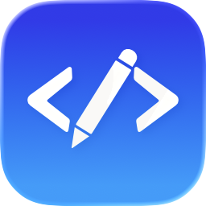
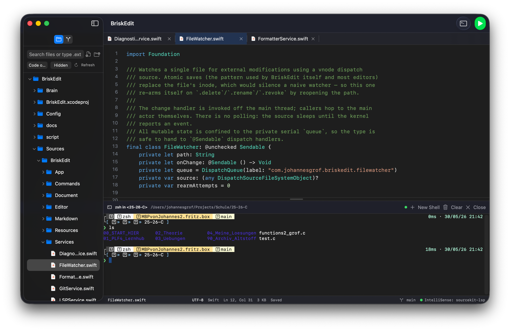

<div align="center">

# BriskEdit



A native macOS text editor for developers. Built in SwiftUI and AppKit, not Electron. Opens instantly, stays under 120 MB idle, runs your code from a button that just figures out the toolchain itself.

[](https://github.com/jx-grxf/BriskEdit/actions/workflows/ci.yml)
[](https://github.com/jx-grxf/BriskEdit/releases/latest)


[Download](https://github.com/jx-grxf/BriskEdit/releases/latest) · [Architecture](ARCHITECTURE.md) · [Release runbook](docs/release.md) · [Security](SECURITY.md) · [Roadmap](#roadmap)

</div>

> [!TIP]
> Built for the exact moment when you open VS Code to fix one typo and watch 2 GB of RAM disappear, an extension host crash a CPU core, and a folder index spin for thirty seconds. BriskEdit opens before your finger leaves the trackpad.

## What it does

- **Opens files instantly.** TextKit 2 NSTextView, no background indexing on launch. A 100 MB log opens without freezing the UI.
- **Workspace, not document soup.** Open a folder, tabs persist, sidebar shows the file tree, split panes when you want them.
- **Run code from a button.** `Run` discovers the right toolchain for the file (clang/gcc for C, swiftc for Swift, python3 for Python, node/deno for JS/TS, cargo for Rust, go for Go) and runs it in the integrated terminal. No tasks.json, no launch.json, no extension to install.
- **Integrated terminal that actually feels like Terminal.app.** SwiftTerm-backed, real zsh, multiple tabs, cwd follows the workspace root, kills cleanly.
- **Markdown preview as a split.** Live render, scroll sync, GFM, sanitized.
- **Find / replace that doesn't blink.** In-file regex, in-folder with `.gitignore` respected, Command Palette and a fuzzy Go-to-File palette (⌘P) for everything else.
- **Code intelligence from the tools you already have.** Completion and live diagnostics via the language servers on your box (clangd, sourcekit-lsp, gopls, pyright, rust-analyzer, typescript-language-server) — no marketplace, no install step. A zero-config `Check File` (⌘B) syntax-checks C/C++/Swift even without a server; errors and warnings surface in the status bar.
- **Stays out of your way.** Format-on-save with your installed formatter, session restore, and live reload when a file changes on disk.
- **Lives in macOS.** Native menus, Settings scene, Services menu, share extensions, Quick Look, Sparkle updates.

The point is the absence of bloat. No telemetry, no account, no LSP extension marketplace, no electron, no second runtime. Just the editor and the tools you already have on the box.

## Showcase

<p align="center">
  <video src="https://github.com/user-attachments/assets/f99a059e-b621-41fd-88f9-8073c551e313" width="900" controls autoplay muted loop playsinline></video>
</p>
<p align="center">
  <a href="https://github.com/jx-grxf/BriskEdit/raw/main/.github/assets/briskedit-promo.mp4"><b>▶ Watch the demo</b></a>
</p>

### Screenshots

| Editor workspace |
|---|
|  |

## Install

1. Download the latest `BriskEdit-<version>.dmg` from [GitHub Releases](https://github.com/jx-grxf/BriskEdit/releases/latest).
2. Open the DMG and drag `BriskEdit.app` into Applications.
3. Launch from Applications or `open -a BriskEdit`.
4. First launch on an unsigned preview build: right-click `BriskEdit.app` → Open → confirm. Developer ID notarization is queued for the first paid release.

Requires macOS 26 or newer. No account, no cloud sync, no analytics, no backend.

## How `Run` works

The Run button reads the active document's language and walks a static toolchain table:

| Language | Detection | Toolchain |
|---|---|---|
| C / C++ | `.c .h .cpp .hpp .cc .mm` | `xcrun --find clang` → fallback `gcc`, build to a temp binary, exec it |
| Swift | `.swift` | `xcrun --find swift`, prefer `swift script.swift`; for SwiftPM projects, `swift run` from the package root |
| Python | `.py` | `python3` (or `python`) from `PATH` |
| JavaScript / TypeScript | `.js .mjs .cjs .ts .tsx` | `node` or `deno` if installed |
| Rust | `.rs` | `cargo run` if `Cargo.toml` is reachable, else `rustc` + exec |
| Go | `.go` | `go run` against the file or the enclosing package |
| Shell | `.sh .zsh .bash` | the matching interpreter from `PATH` |

No `tasks.json`, no per-project config required for the trivial cases. When something does need configuration (build flags, run args, env), it lives in a single `briskedit.run.json` at the workspace root — opt-in, not the default.

The toolchain discovery and exec live in `RunService`. The Run button only ever shells out on user action and surfaces its stdout/stderr in a dedicated terminal tab.

## Safety

- No background filesystem watcher beyond the active workspace root.
- No telemetry, no analytics, no remote evaluation.
- `Run` never executes on file save or autocomplete — only on the explicit button or `⌘R`.
- The integrated terminal inherits a filtered environment by default.
- Workspace state and recent files live in `~/Library/Application Support/BriskEdit` — `rm -rf` removes every trace.

## Build from source

```bash
git clone https://github.com/jx-grxf/BriskEdit.git
cd BriskEdit
brew install xcodegen
xcodegen
xcodebuild -project BriskEdit.xcodeproj -scheme BriskEdit -configuration Debug build
open ~/Library/Developer/Xcode/DerivedData/BriskEdit-*/Build/Products/Debug/BriskEdit.app
```

The `project.yml` is the source of truth — the `.xcodeproj` is generated and `.gitignored`. Regenerate after editing `project.yml`.

Run convenience:

```bash
./script/build_and_run.sh        # build + launch a debug bundle
./script/build_and_run.sh build-only
```

To package a local DMG:

```bash
BRISKEDIT_VERSION=0.1.0 ./script/package_dmg.sh
```

## Release pipeline

GitHub Actions builds tagged releases: app bundle, DMG, Sparkle ZIP and appcast, signature verification, and (once Developer ID is configured) notarization + stapler validation. Full runbook in [docs/release.md](docs/release.md). Public release notes live in [RELEASE_NOTES.md](RELEASE_NOTES.md).

Distribution roadmap:

- Developer ID signing and notarization once Apple Developer enrollment lands.
- Homebrew Cask submission after the first notarized release.

## Roadmap

- **MVP-0** (now): App shell, workspace, file tree, tabs, NSTextView editor with gutter, find/replace, Command Palette, Settings, Sparkle updates.
- **MVP-1**: Integrated terminal (SwiftTerm), Markdown preview split, Run button with toolchain discovery.
- **V1** (in progress): LSP client (completion + diagnostics ✅; hover/go-to-def next), find-in-folder ✅, format-on-save ✅, session restore ✅, live reload-on-change ✅, fuzzy Go-to-File ✅, diagnostics in the status bar ✅. Remaining: line-number gutter + git status in gutter (the old NSRulerView is incompatible with the TextKit 2 text view — needs a TextKit 2-native gutter), Tree-sitter syntax highlighting + folding.
- **V1.5**: Themes, snippets, EditorConfig, multi-cursor.
- **Later**: Debug Adapter Protocol, integrated build/run tasks, remote SSH, macro recorder.

Explicitly **not** doing: third-party extension marketplace, telemetry, account system, cloud sync, AI-completion engine as a built-in.

## Tech stack

SwiftUI · AppKit (`NSTextView` with TextKit 2, `NSRulerView`) · macOS 26+ · `@Observable` · Swift 6 strict concurrency · Swift Package Manager (consumed via Xcode) · `xcodegen` for project generation · GitHub Actions on macOS · Sparkle for updates · SwiftTerm for the integrated terminal · swift-markdown for the preview · SwiftTreeSitter for syntax (V1).

## Contributing

Issues and focused pull requests welcome. Read [CONTRIBUTING.md](CONTRIBUTING.md), keep changes scoped, run the build before opening a PR. Security reports go through [SECURITY.md](SECURITY.md).

## License

MIT. See [LICENSE](LICENSE).
